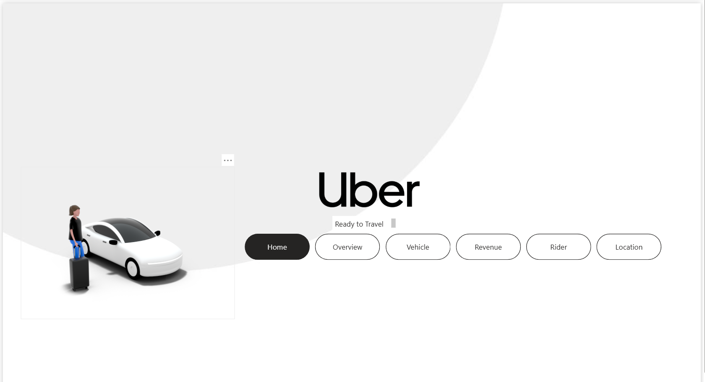
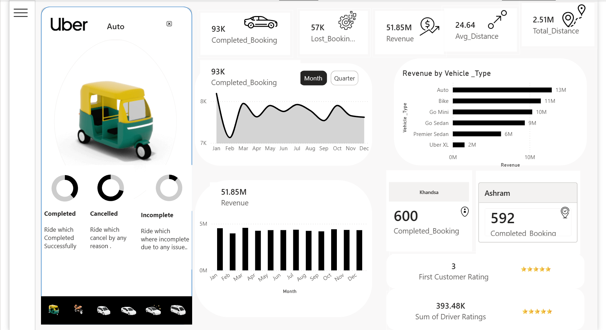
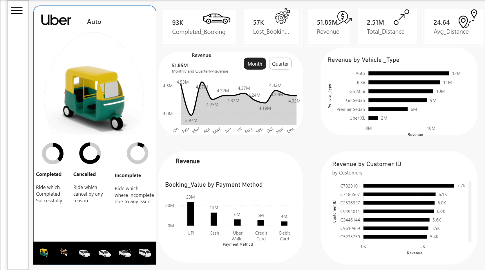
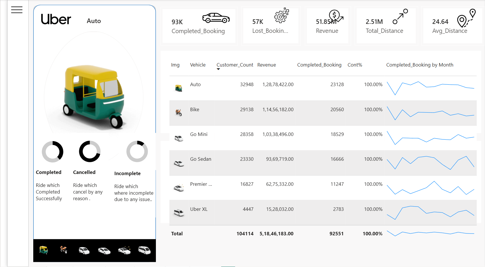
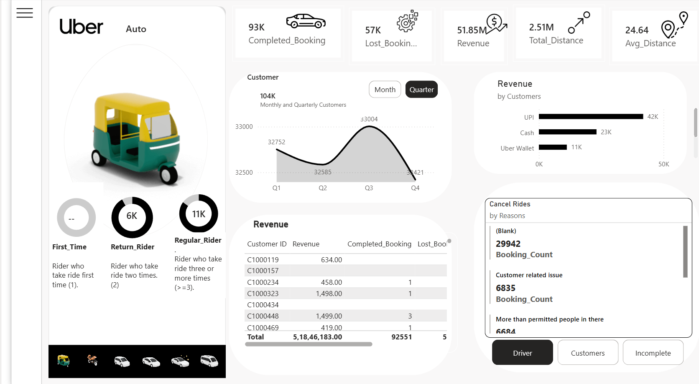
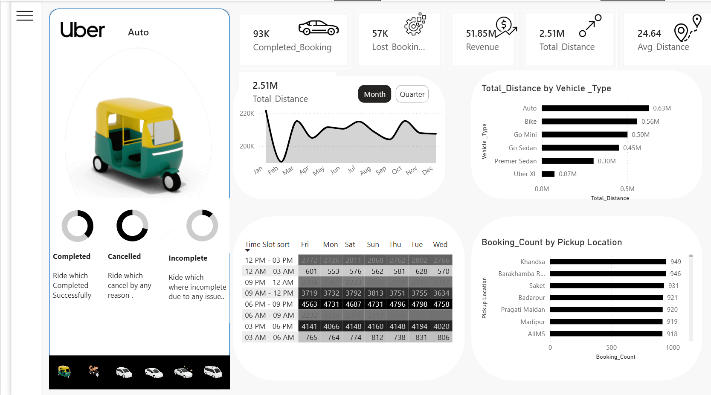

# 🚖 Uber Ride Operations & Revenue Analytics Dashboard

A comprehensive Power BI Project (`.pbip`) designed to analyze ride-hailing operational performance, driver/rider behaviors, revenue generation, and vehicle utilization tracking across 93K completed bookings.

---

## 🧭 Application Navigation Hub
The report is designed with an intuitive, app-like landing interface allowing users to seamlessly navigate through specific business dimensions using interactive buttons:

---

## 📊 Dashboard Breakdown & Core Views

### 1. High-Level Operations Overview
Provides a macro window into key performance indicators (KPIs) such as total revenue ($51.85M), booking completion vs. loss trends, volume hot-spots by location, and peak booking hourly time slots.

### 2. Revenue & Financial Insights
Tracks cyclical revenue performance across months and quarters, breaking down absolute booking value streams by transaction payment methods (UPI, Cash, Wallets) and isolating high-value corporate or individual customer segments.

### 3. Vehicle & Fleet Optimization
Deep-dives into fleet distribution matrix models. This view tracks operational volume metrics, revenue share, and completion trend lines categorized entirely by vehicle segments (Auto, Bike, Go Mini, Sedan, Premier, XL).

### 4. Behavioral Customer Matrix
Differentiates user distribution segments between first-time, returning, and highly active regular riders. It also provides a granular look at absolute booking cancellations segmented by distinct drivers or customer-facing issues.

### 5. Geospatial Analytics & Hub Tracking
Isolates localized performance parameters down to specific pickup hubs (e.g., Khandsa, Saket, AIIMS, Ashram) while cross-referencing average trip distance distributions and regional driver/customer ratings.

---

## 🛠️ Data Modeling & Key Insights Built-In
* **Star Schema Implementation:** Built using a central Fact table of ride transactions connected to specialized Dimension tables (Time, Vehicle, Customer, and Geography).
* **Payment Trends:** Digital transactions (UPI and Wallet) hold a dominant share over traditional cash settlement options.
* **Peak Utilization:** Clear operational spikes are visible in the afternoon (12 PM - 3 PM) and evening shifts (6 PM - 12 AM) across dense municipal hubs.
